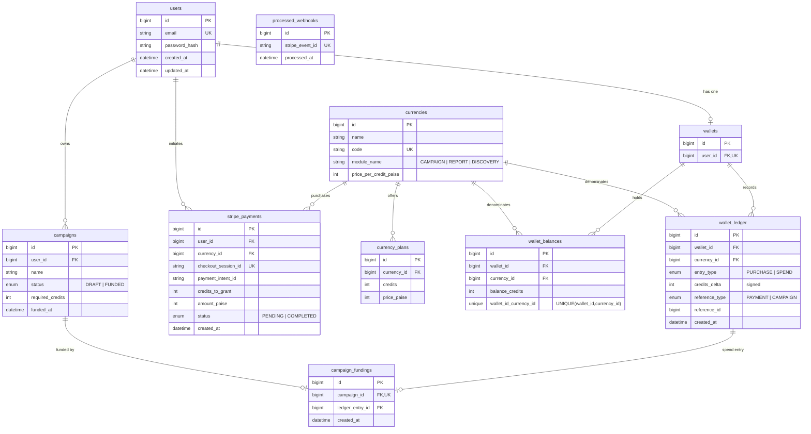

# DESIGN.md

This document describes the data model and the correctness guarantees of the
Multi-Currency Credits Wallet & Campaign Funding system: idempotency,
transaction boundaries, concurrency control, and failure handling.

---

## 1. ER Diagram



### Money & credit modelling

- All prices are stored in **paise** (integers) — no floating point money.
- `wallet_balances.balance_credits` is a **materialized** balance.
- `wallet_ledger.credits_delta` is **signed**: `+credits` for `PURCHASE`,
  `-credits` for `SPEND`. The invariant **balance = Σ(credits_delta)** per
  `(wallet_id, currency_id)` is maintained because every balance mutation and
  its ledger row are written inside the **same transaction**.

---

## 2. Idempotency strategy

Two independent operations must be idempotent: **granting credits from a Stripe
webhook** and **funding a campaign**.

### Webhook idempotency (credits granted exactly once)

The cornerstone is the table:

```
processed_webhooks(stripe_event_id UNIQUE)
```

When a `checkout.session.completed` event arrives, the very first statement
inside the transaction is:

```sql
INSERT INTO processed_webhooks (stripe_event_id) VALUES (:eventId);
```

- **First delivery:** the insert succeeds; we proceed to grant credits.
- **Duplicate delivery (same `event.id`):** the insert violates the UNIQUE
  constraint, the transaction rolls back, and the handler returns
  `{ status: "duplicate" }` with HTTP 200 (so Stripe stops retrying). **No
  credits are granted a second time.**

A **second, defensive guard** exists: the `stripe_payments.status` is checked
while the payment row is locked `FOR UPDATE`. If it is already `COMPLETED`, the
grant is skipped. This protects against pathological cases such as two *distinct*
event IDs pointing at the same checkout session.

### Campaign funding idempotency (funded once)

Backed by `campaign_fundings.campaign_id UNIQUE`, plus the `campaigns.status`
check performed while the campaign row is locked `FOR UPDATE`. Even under a race,
the second transaction either sees `status = FUNDED` or fails the UNIQUE insert.

---

## 3. Transaction boundaries

All multi-step state changes run inside a single `sequelize.transaction(...)`
(MySQL InnoDB, default `REPEATABLE READ`). The service layer owns transactions;
repositories accept the transaction handle and apply row locks.

### A) Webhook → grant credits

```
BEGIN
  INSERT processed_webhooks(stripe_event_id)        -- claims the event (UNIQUE)
  SELECT * FROM stripe_payments
        WHERE checkout_session_id = ? FOR UPDATE     -- lock payment row
  IF payment.status = 'COMPLETED' -> return (guard)  -- already granted
  UPDATE stripe_payments SET status='COMPLETED'
  -- ensure + lock balance row
  SELECT * FROM wallet_balances
        WHERE wallet_id=? AND currency_id=? FOR UPDATE
  INSERT wallet_ledger(entry_type='PURCHASE', credits_delta=+n, ref=PAYMENT)
  UPDATE wallet_balances SET balance_credits = balance_credits + n
COMMIT
```

Any failure → `ROLLBACK`: the `processed_webhooks` row is also rolled back, so
Stripe can safely retry the event later.

### B) Fund campaign → spend credits

```
BEGIN
  SELECT * FROM campaigns WHERE id=? FOR UPDATE       -- lock campaign
  IF status='FUNDED' -> ROLLBACK (409)
  IF exists campaign_fundings(campaign_id) -> ROLLBACK (409)
  validate credits == required_credits
  SELECT * FROM wallet_balances
        WHERE wallet_id=? AND currency_id=? FOR UPDATE -- lock balance
  IF balance < credits -> ROLLBACK (400 insufficient)
  UPDATE wallet_balances SET balance_credits = balance_credits - credits
  INSERT wallet_ledger(entry_type='SPEND', credits_delta=-credits, ref=CAMPAIGN)
  INSERT campaign_fundings(campaign_id, ledger_entry_id)   -- UNIQUE backstop
  UPDATE campaigns SET status='FUNDED', funded_at=NOW()
COMMIT
```

### C) Signup → user + wallet

User row and its wallet row are created in one transaction so a user can never
exist without a wallet.

---

## 4. Concurrency handling

The system relies on **pessimistic row locks** (`SELECT … FOR UPDATE`) rather
than optimistic retries, because credit/money operations must be strictly
serialized.

- **Overspend protection:** the `wallet_balances` row for `(wallet, currency)`
  is locked `FOR UPDATE`. Concurrent spends against the same balance **serialize
  on that lock**. Each transaction re-reads the *current* balance under the lock
  and verifies `balance >= credits` before deducting. The loser sees the reduced
  balance and is rejected.
- **Double-funding protection:** the `campaigns` row is locked `FOR UPDATE`, so
  two concurrent funding attempts on the same campaign serialize; the second sees
  `status = FUNDED`. The `campaign_fundings.campaign_id` UNIQUE constraint is the
  final database-level backstop if logic is ever bypassed.
- **Duplicate webhooks:** serialized by `processed_webhooks` UNIQUE insert and by
  the `FOR UPDATE` lock on the payment row.
- **Lock ordering:** funding always locks **campaign first, then balance**, which
  keeps a consistent acquisition order and avoids deadlocks across funding
  operations.

---

## 5. Failure scenarios

| Scenario                                          | Behaviour                                                                 |
| ------------------------------------------------- | ------------------------------------------------------------------------ |
| Invalid webhook signature                         | `400`, nothing processed (verified before any DB work)                   |
| Webhook arrives before payment row committed      | `findBySessionIdForUpdate` returns null → `{status:"no_payment"}`, event still recorded; Stripe retry will succeed once the row exists *(see note)* |
| Webhook delivered twice (same event id)           | UNIQUE violation on `processed_webhooks` → `{status:"duplicate"}`, granted once |
| Two distinct events for same session              | Second blocked by `payment.status = COMPLETED` guard                      |
| Crash mid-transaction                             | Full `ROLLBACK`; `processed_webhooks` row rolled back → safe Stripe retry |
| Fund with REPORT/DISCOVERY credits                | `400` before any txn (module binding check)                              |
| Fund with insufficient balance                    | `400`, `ROLLBACK`, balance unchanged                                     |
| Fund an already-funded campaign                   | `409`, `ROLLBACK`                                                        |
| Concurrent spends exceeding balance               | Exactly one succeeds; others `400`; balance never negative               |
| DB unique/constraint error elsewhere              | Mapped to `409` by the central error handler                            |

> **Note:** because `create-checkout-session` writes the PENDING
> `stripe_payments` row synchronously *before* returning the checkout URL, the
> payment row always exists well before the webhook fires in practice. The
> `no_payment` branch is a defensive fallback.

---

## 6. Why duplicate webhooks are safe

1. Stripe may deliver the same event multiple times (at-least-once delivery).
2. The handler **claims** each event by inserting its `stripe_event_id` into
   `processed_webhooks` (UNIQUE) as the first action of the transaction.
3. A duplicate delivery therefore **fails the insert**, the whole transaction
   rolls back, and no ledger/balance changes happen — the response is still
   `200` so Stripe stops retrying.
4. Even if two duplicates raced to that insert simultaneously, InnoDB
   serializes them: one commits, the other gets the unique violation.
5. The `payment.status = COMPLETED` check (under `FOR UPDATE`) is a second
   independent guard.

**Result:** credits are granted **exactly once** per checkout, regardless of how
many times the event is delivered. This is verified by
`tests/webhook.idempotency.test.ts` (one ledger entry, balance increased once).

---

## 7. Why overspending is impossible

1. Funding opens a transaction and locks the exact `wallet_balances` row with
   `SELECT … FOR UPDATE`.
2. While holding that lock, it re-reads the **authoritative current balance** and
   checks `balance >= credits`. If not, it **rolls back** with `400`.
3. Any concurrent funding against the same balance **cannot read or modify** that
   row until the first transaction commits/rolls back — it blocks on the lock,
   then observes the *updated* balance.
4. The column `balance_credits` is `UNSIGNED`, so the database itself would
   reject a negative value as a last-resort backstop.

Therefore two concurrent 80-credit spends against a 100-credit balance can never
both succeed: the first deducts to 20, the second then sees 20 < 80 and is
rejected. Final balance is deterministically **20**, never negative. This is
verified by `tests/concurrency.spend.test.ts`.
```
